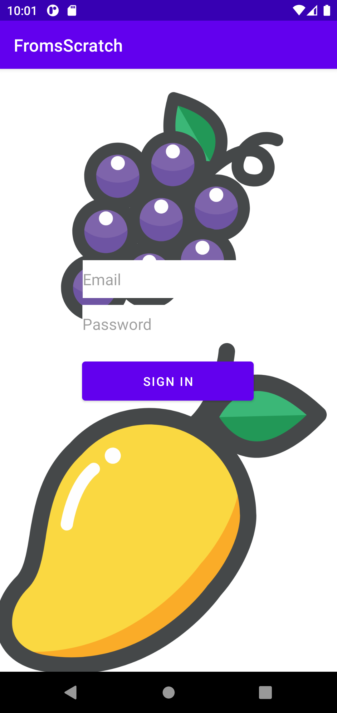
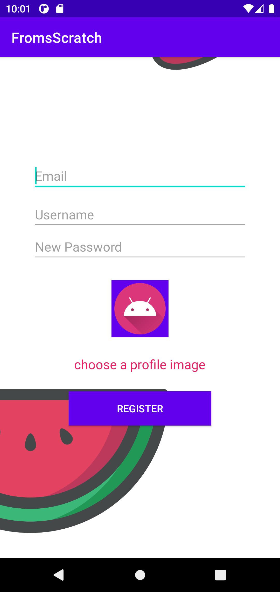
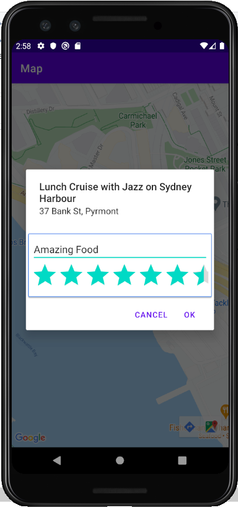
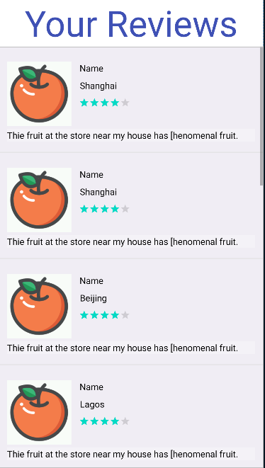

# Grocery Store Rating App
Android application written in kotlin that finds nearby grocery stores and shows their overall rating among other users of the app. Users can submit their ratings and revies of a nearby grocery store by selecting it on the map screen inside the app. 

##  Skills used
The app is written in kotlin but programming was not the biggest challenge. I had to implement Google APIs such as Maps, and POIS. In addition, I had to work with location data such as finding the position of something given its address and vice versa (getting the address of a longitude and latitude). I needed to be very aware of the user's location services, permissions, and state at all times. Furthermore, implementation of a map inside my app and learning to manipulate it and work in my favor was a very important skill I practiced.

#### Upon entering app

#### Authentication
Firebase authentication was used to register and login users using the email and password they provided when they registered.

  
  

  
  #### Maps and Places
  The user can go to the Map Screen when they want to find groceries near them. The grocery stores are identified by a marker that displays the overall rating of the grocery store. Users can tap this marker and write their own review. This was all done using the Google Maps API, Places API.
   
   
  #### Writing a review
  When a user writes a review, it gets saved to Firebase's Realtime Database. The review is both added to the users review history, as well as the particular grocery store. Adding a review causes the store's overall rating to change as well. 
  
 
 ###### RIP
 The realtime database no longer exists and the API keys no longer work so although this app was once in its hayday, it no longer functions right. 
  
